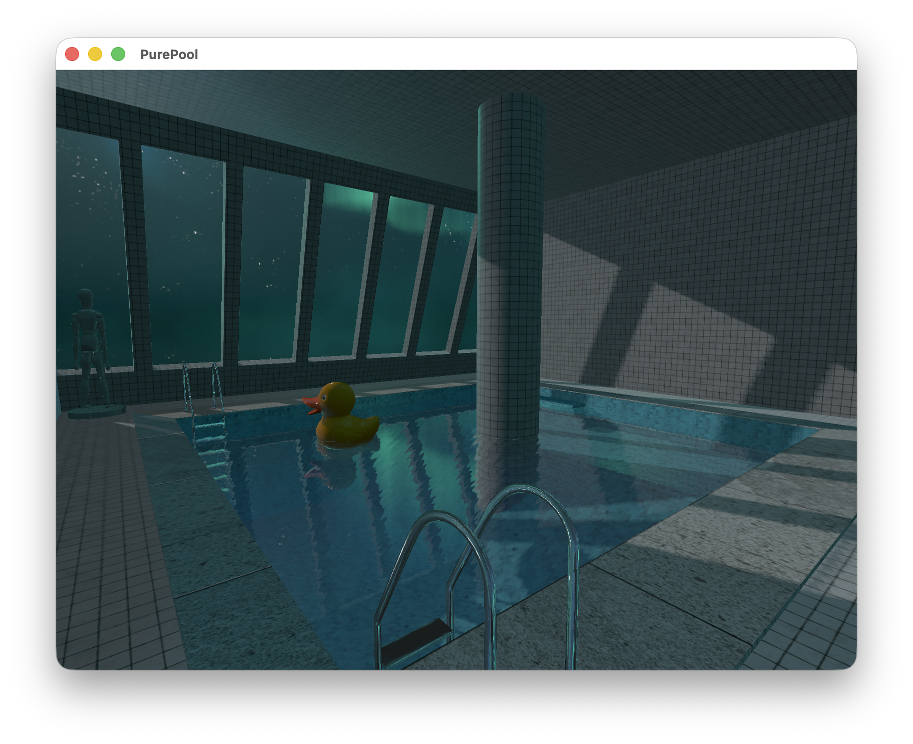

# PurePool

[](https://en.wikipedia.org/wiki/C%2B%2B17)
[](https://www.opengl.org/)
[](https://cmake.org/)
[](https://opensource.org/licenses/MIT)

> 基于现代 OpenGL 的实时渲染项目，聚焦水体渲染、多 Pass 管线与物理一致的光照模型。  
> 涵盖水面反射/折射、PBR 材质、IBL 环境光照与阴影映射。




---

## ✨ 核心特性

### 🌊 水体渲染
- **多 Pass 反射/折射管线** — 基于 FBO 分别生成反射与折射结果，视角相关混合
- **Fresnel 菲涅尔效应** — Schlick 近似，动态调节反射与折射权重
- **DUDV 扰动与动态波动** — 通过 DUDV 贴图与时间参数模拟水面流动
- **基于深度的水体吸收** — Beer–Lambert 定律模拟深水变暗效果

### 🎨 物理基础渲染（PBR）
- **Cook–Torrance BRDF（GGX）** — 金属度/粗糙度工作流，能量守恒
- **法线贴图与 TBN 空间** — 支持非一致缩放下的正确法线扰动
- **多光源模型** — 方向光、点光与聚光灯统一纳入 PBR 计算

### 🌅 IBL 环境光照
- **HDR → Cubemap 转换** — GPU 上将经纬度 HDR 贴图转换为立方体贴图
- **Irradiance / Prefilter / BRDF LUT 预计算** — 完整 IBL 漫反射与高光支持
- **与直接光照协同** — 环境能量分布 + 局部高频细节

### 🌑 阴影映射
- **方向光 Shadow Map** — 基于正交投影的深度贴图生成实时阴影
- **PCF 软阴影** — 多重采样平滑阴影边缘
- **自适应光空间范围** — 根据场景 AABB 自动调整阴影覆盖范围

---

## 🚀 快速开始

```bash
# 克隆项目（含子模块）
git clone --recurse-submodules https://github.com/awaken-psy/purepool.git
cd purepool

# 构建
mkdir -p build && cd build
cmake .. && cmake --build .

# 运行（需在 build/ 目录下执行）
./PurePool
```

> ⚠️ 资源路径基于相对路径 `../` 解析，请在 `build/` 目录中运行程序。

---

## 🛠️ 技术栈

| 组件 | 版本 | 用途 |
|------|------|------|
| C++ | 17+ | 核心语言 |
| OpenGL | 4.1+ | 图形渲染 API |
| CMake | 3.10+ | 构建系统 |
| GLFW | 3.3+ | 窗口与输入管理 |
| GLM | — | 数学库 |
| tinygltf | — | glTF 2.0 模型加载 |
| stb_image | — | 纹理加载 |

---

## 📂 项目结构

```
PurePool/
├── code/
│   ├── Inc/          # 头文件
│   ├── Src/          # 实现文件
│   └── Shaders/      # GLSL 着色器
├── resources/
│   ├── blender/      # 3D 模型
│   ├── water/        # 水面贴图
│   ├── hdr/          # HDR 环境光照贴图
│   └── skybox/       # 天空盒
└── external/         # 第三方库
```

---

## 🚧 未来计划

- [ ] 改进波浪模型与屏幕空间反射
- [ ] 点光 / 聚光阴影支持
- [ ] 实验性光线追踪或混合渲染
- [ ] 渲染调试与可视化工具

---

## 📄 许可证

[MIT License](LICENSE)
